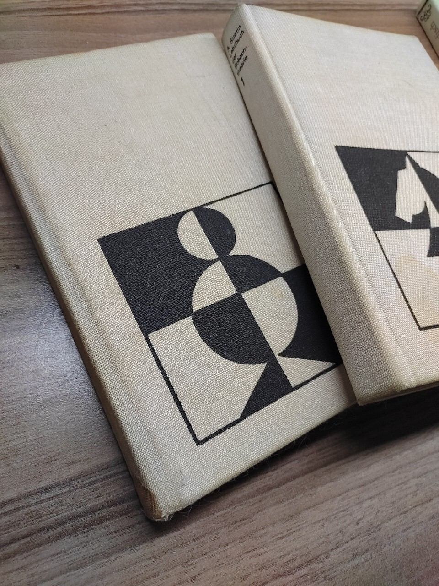

In my first year returning to the world of chess, I found myself gravitating towards familiar openings that had accompanied me throughout my chess journey—classical e4-e5 structures as White and various Sicilian lines as Black. The board held images of these timeless patterns, reflecting years of experience. Yet, despite my long-standing relationship with these openings, I found myself confronted by a puzzling reality: my online ratings oscillated within the range of 600 to 800. Frustratingly, improvement seemed to elude me.

As a self-proclaimed visual thinker, I often relied on mental snapshots of openings, charting out the well-trodden paths of e4-e5, King's Pawn Opening, is the most popular first move at all levels of the game and was the favorite opening move of world champion Bobby Fischer, who called it best by test and the intricate twists of the Sicilian. 

However, the results on the board seemed to defy the images etched in my mind. Something needed to change.

In a chess landscape dominated by an influx of digital tools, relentless chess engines, and the specter of cheaters, I realized that the path to improvement was not as straightforward as I had once believed. The traditional methods that had served me well before were no longer yielding the results I desired. It was time to take a bold step—to relinquish the familiar and embark on a journey of unlearning.

A pivotal moment came when I shared a game with Christopher Ward—an accomplished player from whom I gleaned valuable insights. While my encounter with him led to a stunning victory as Black, the subsequent analysis prompted me to reevaluate my opening choices. What I had once considered solid and reliable was now cast in a different light.

Embracing change, I delved into the world of openings, searching for paths less traveled. The Reti and the London System emerged as intriguing candidates for my White repertoire, while the dynamic Kings Indian and the unorthodox Pirc beckoned to me as Black. These openings, I believed, would provide me with the flexibility and transpositional possibilities necessary to challenge opponents and breathe new life into my games.

This journey of transformation began with books—ancient tomes that had been entrusted to me by a dear friend, Robert Lesniak of Germany. A skilled player in his own right, Robert imparted his wisdom and kindled my passion for chess. It was he who introduced me to the world of chess computers in the early 80's, demonstrating the incredible potential of technology as a training tool. The echoes of his guidance and the lessons from those cherished books laid the foundation for my path forward.
So, I went back to the two books he gifted me, Alexander Suetin 

The Reti was it for White, the Pirc for Black and I started to study in depth, first with these books.
ChessBase was my friend and so the implemented training for repertoires.

Here is an example you might find useful how to do this. The man and legend himself, Matthias Wüllenweber- has recorded the youtube video.

## Repertoire Training in ChessBase

Learn how to train your opening repertoire in ChessBase with Matthias Wüllenweber.

> **Note:** [Subscribe to receive updates](https://follow.it/senior-chess-improver?leanpub)
