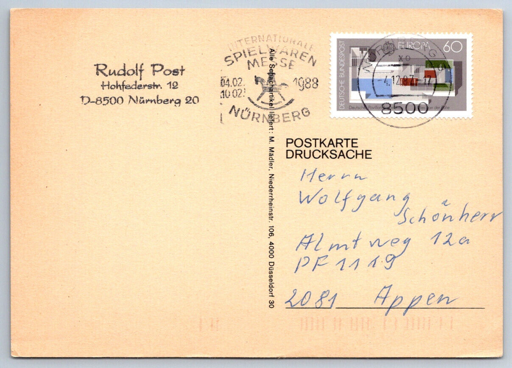
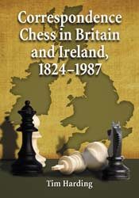
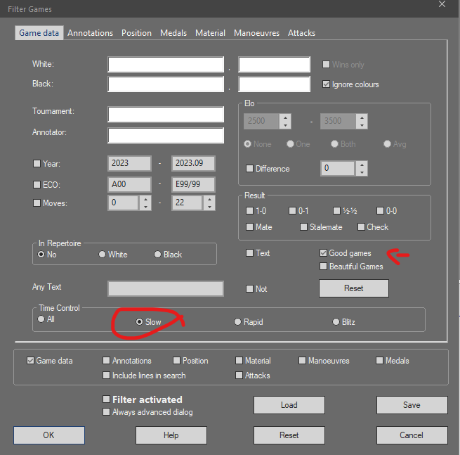

    <blockquote><em>"The principal attraction of correspondence chess is the freedom to play chess as and when it suits you."
    </em> <footer>
     - Stan Steliga</footer>
    </blockquote>

# Introduction:

    
    

Correspondence chess is a form of chess where players exchange moves through mail or other forms of communication, and games can take weeks, months, or even years to complete. This slow pace allows players to take their time to analyze the position and find the best move. Consulting opening and endgame materials have always been acceptable during correspondence chess. In the dynamic realm of chess, digital technology has brought forth tools that revolutionize how players prepare, analyze, and perfect their strategies. Correspondence chess has witnessed a paradigm shift with the integration of reference databases. In this blog, we explore how players can elevate their correspondence chess skills using Chessbase's Mega Database and delve into the unique features of UltraCorr23.

    <blockquote><em>"Life’s too short to play boring chess."</em> - Michael Song, The Chess Attacker's Handbook
        </blockquote>

This quote reminds us that chess is not just a game but a passion that requires creativity, imagination, and a willingness to take risks. Playing it safe may lead to a draw, but it won't lead to the excitement and thrill of a well-executed attack or defense. So, let's embrace the challenge and make every move count!

# Engine Usage in Correspondence Chess:

Understanding engine usage is crucial as it influences how players use reference databases. In correspondence chess, there are three main types of games:

- Snail version (e.g., Golden Knights tournament): Correspondence games played via traditional mail. Typically, no engines are allowed in these games.
- Email version (e.g., Electronic Knights tournament): Games conducted via email communication. No engines are allowed in these games.
- Server version (e.g., ICCF or SchemingMind): Games played on online chess servers. In ICCF tournaments, consulting an engine is allowed; in SchemingMind, it's not.

Additionally, in all USCF chess tournaments, played via ICCF server engines are not allowed (such as ICCF-US Friendly Matches from around the world).

Does correspondence chess hold significance in 2023, when chess engines undoubtedly surpassed the best humans in 2005? Is it proper for a chess player to study a database of correspondence chess games or use it as a reference?

Here is my take after years of playing correspondence chess in the above setups. Let's assume you play a tournament where engine consultation is allowed. Even then, the strongest players will still navigate their engine usage far better than an average player would, and none are foolish enough to let the engine sit on a position for a day or create a compute cluster with 128 cores or so and play the move. It's a very effective way to lose, I can tell you! But that's a different story we'll explore in another blog.

However, it's a matter of fact that the increase in draws among the top players is a challenge. ICCF is doing some exploration on how to modify the rules. Now, what is your toolbox to be prepared for your game? A toolbox that allows you to analyze and make decisions. A toolbox that will enable you to prepare against your opponent? A reference database it's that simple like that. Can you 100% rely on a reference database? Of course not. The above statement is the same: a foolish decision, and you will sit on a sinking ship.

Let's check on reference databases, and how to build your own that suits you best.

# Reference Databases in Correspondence Chess:

Reference databases are invaluable resources that provide players with a comprehensive collection of chess games, openings, variations, and analyses. These databases serve as indispensable aids for players' preparation, opening repertoire development, and overall strategic improvement.

And especially in correspondence chess, you must always vary and try new approaches, or your opponents get wise to your repertoire and prepare nasty traps you might need to know.

That said, I thought about how to build a reference database to support me best.

**1. Chessbase: An Expansive Repository of Chess Knowledge**

At the forefront of chess software is Chessbase, renowned for its versatile tools that cater to players at all levels. While discussing Chessbase, it's worth noting that they offer the "Corr Database 2022," a substantial collection of correspondence games spanning from 1804 to 2021. This database boasts more than 80,000 tournaments and over 2 million correspondence games.

- **Mega Database**: A vast collection of over 8 million games empowers players to refine their opening repertoire and grasp essential concepts. Although not explicitly tailored for correspondence chess, this database provides a wealth of historical and contemporary games from which players can draw inspiration.

- **Corr Database 2022**: This database is for correspondence chess enthusiasts and contains an extensive collection of correspondence games. It is popular among fans of correspondence chess and many grandmasters and trainers. Correspondence games often serve as a herald for the development of opening theory.

**UltraCorr23: A Dedicated Correspondence Chess Hub**

UltraCorr23 is a specialized reference database exclusively tailored for correspondence chess enthusiasts. It is meticulously crafted in ChessBase format to ensure compatibility with various software versions, extending back to ChessBase 8 and other software like Fritz. The UltraCorr2023 database has over 2,452,000 games and is edited by chess historian and [CC master Tim Harding](http://www.chessmail.com/UC-2023/Introducing-UC2023.html). 

>It is the most accurate correspondence chess game database ever published.

**Content Overview of UltraCorr:**
- **Server Games**: This database is a treasure trove for correspondence chess aficionados, encompassing recently played games from renowned servers such as ICCF, LSS, and FICGS, with updates extending to the end of 2022.

- **Historical Gems**: UltraCorr23 is committed to preserving the rich history of correspondence chess, and the year 2022 witnessed an extensive effort to incorporate historical correspondence chess games from the 19th and 20th centuries. Notably, games from Professor Pagni's book collections were included, with meticulous corrections based on comprehensive research.

- **19th Century Games**: The database offers a unique window into 19th-century chess, with a wealth of games from Deutsche Schachzeitung and other printed sources.

- **Postal Chess Rescued**: Maurice H. Carter, an Ohio tournament director, made a significant contribution by providing late 20th-century postal games, many from American team matches, and the complete record of the Horowitz Memorial international tournament. These previously unavailable games have been preserved.

- **Data Improvements**: Manuscripts from contributors facilitated the addition of previously unavailable games and allowed for corrections to dates and game scores, enhancing the overall quality of UltraCorr.

- **Crowdsourced Contributions**: Readers' contributions, including corrections and additional games, enriched UltraCorr23, making it an ever-evolving resource.

**Enhancements and Challenges:**
- **Data Quality**: UltraCorr23's creators are committed to improving player and event identification while eliminating low-quality duplicates and fragments that posed challenges in earlier versions.

- **Player Identification**: Despite best efforts, player identification remains complex, especially with variations in player registrations. Ongoing work aims to rectify discrepancies, particularly for players with common surnames.

    <blockquote><em>"There is a lot of things you can learn from correspondence chess. I learned a lot by looking at the games – basically Correspondence Chess involves using computers nowadays to help you process along, but also to guide the computer with human intellect, so a combination which should lead to the strongest factors out there. The level of chess we see in the Correspondence World Championships is the highest out there"</em> <footer>—GM Simon Williams, <cite>Ginger GM</cite>, commentator and attacking player from England</footer>
        </blockquote>

# What to do with this Knowledge:

When preparing openings, analyzing games, or planning strategies, you can switch back and forth between both databases. Here's a different approach I've found valuable, though I'm still exploring if it's the ideal setup:

1. Begin with Mega Database and select all slow games, moving them into a new database.
2. Add the correspondence games from UltraCorr.
3. Tag all top games and keep them while eliminating less important ones.
4. This refined database becomes your new reference database.

To reach chances in Correspondence games, you need to get a strategically very complex position because in these complex positions, there are many lines which even a computer would show as 0.00, and you have to go extremely deep to have long-term plans, and there you have a chance to outplay your opponent. I repeat myself: even in tournaments where engines are allowed, you will fail if you are using the engine and don't understand your game's strategic and tactical nuances.

That said, I prefer openings and strategies off the beaten path. Otherwise, the most you can get is a draw, especially with all these very experienced correspondence players. In most cases, you lose.

# Conclusion:

The realm of correspondence chess is one of intricate moves, strategic depth, and the thrill of unfolding battles across time. Reference databases have emerged as indispensable companions for players, aiding them in honing their skills and understanding the game's complexities. While Chessbase's Mega Database provides a plethora of games, UltraCorr23 stands as a dedicated resource that caters to the unique needs of correspondence chess enthusiasts.

Now, the crucial question is, how can you maximize these resources? Simply relying on ChessBase's Mega Database may not suffice in today's noisy online world, where blitz and rapid games abound. Moreover, sifting through low-rated player blitz games might not be fruitful. What proves to be invaluable is the creation of a specialized subset known as the "slow games database" from the Mega Database. To further enhance its utility, consider excluding games played by players rated below 2000 or adjust this threshold according to your preferences. Then, complement this subset with UltraCorr23, eliminating potential duplicates and utilizing this refined database for your correspondence chess endeavors.

As players continue to embrace these tools, the lines between human and machine blur, forging a symbiotic relationship that enriches the world of correspondence chess. With every move made and analyzed, these reference databases solidify their position as cornerstones of chess excellence in the digital age.

**Amici Sumus**

Please send feedback and comments any time!

> **Note:** [Subscribe to receive updates](https://follow.it/senior-chess-improver?leanpub)

> **Note:** [Follow me on Mastodon](https://mastodon.online/invite/mWSpfQP8)
