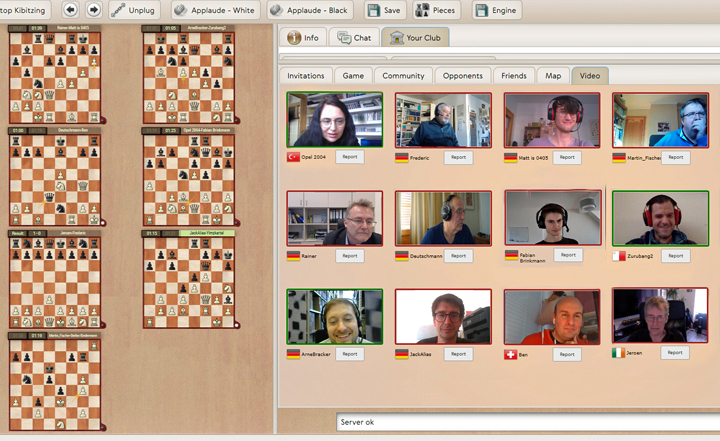
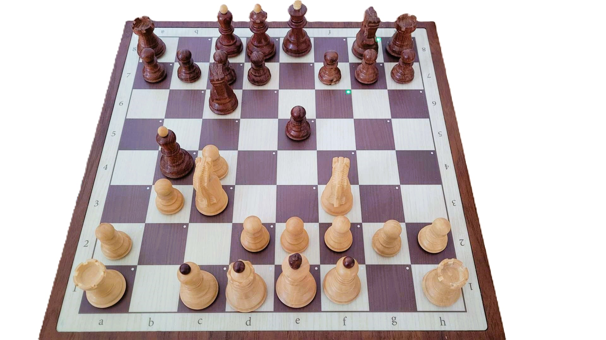

Playchess Group Training (Photo courtesy ChessBase GmbH)

## Reflecting on the Year: A Tech-Driven Chess Odyssey

As the year draws to a close, I've decided to make the final blog of 2023 a bit more tech-driven, sharing my experiences and discoveries in online chess.

In my previous blog, "The Virtues of Slow Play," I emphasized the belief that actual improvement in chess doesn't come from quick online games. Today, I want to delve into a platform beyond mere gameplay – a platform that values strategy, growth, and community. For me, that platform is Playchess.

What I didn't know until some experiments is how smooth my ChessNut e-board works with Playchess. This discovery has been a game-changer, making my chess experience more seamless and enjoyable.

Let's explore my findings and observations about this innovative platform from Chessbase, a privately owned and, in my honest opinion, still thriving and groundbreaking chess software company.

## The Chess Odyssey Begins

While not a big fan of online blitz or rapid games, I found solace and challenge in platforms that valued strategy and growth over quick victories. It's also an excellent way to test your opening knowledge, pattern recognition, and intuition under time pressure.
Lichess was one, but the true gem turned out to be Playchess. I apologize to the chess.com enthusiasts, but Playchess hooked me.

Let's summarize a bit before we go into Playchess details.

ChessBase offers a variety of web tools and an online chess platform that are quite innovative:

### ChessBase Web Tools

ChessBase provides a suite of free web tools that can be embedded in websites, enhancing the user's chess experience. From interactive diagrams to live tournament tracking and tactics training, these tools cater to chess enthusiasts of all levels. A ChessBase Account is essential to unlock these tools' full potential.
ChessBase Web Tools are a suite of free tools designed to enhance the experience of chess fans, clubs, tournaments, bloggers, and players on their own websites. Here are some of the tools you can embed on your website:

1. **Tactics Trainer**: Allows every chess site to offer a tactics trainer for free, no login required.
2. **Live Blitz**: Offers visitors a way to play a quick game.
3. **Own Chess Server**: Allows you to create your own chess server with a few clicks¹.
4. **Fritz Chess Engine**: Provides visitors a quick and easy way to play against or analyze with a strong chess engine right in their browser.

These tools are designed to be easy to embed on your website and tap into the worldwide community of ChessBase's services. They are part of a broader range of ChessBase apps that run exclusively in the browser. These apps cover the full range of ChessBase tools, including the Cloud database tools. 

### Online Chess Platform:
ChessBase's online chess platform, play.chessbase.com, allows users to play rated games against opponents of similar or higher strength, depending on your default pick. The platform offers games with various time controls, from bullet to slow games. Users can also participate in regular tournaments with Ducat's prizes. The platform includes a feature to play against Fritz, a chess program that plays like a human and makes subtle tactical mistakes. Users can also follow live master games from top tournaments.
Here is the live tournament view, where you can predict the next move or bet on the next move.

Your own games are automatically synchronized in your Chessbase or Fritz program.

In summary, ChessBase's web tools and online chess platform provide a comprehensive and innovative suite of tools for chess enthusiasts of all levels. These tools enhance the user's ability to play, learn, and enjoy the game of chess.

## Playchess: Beyond the Chessboard

Not just a platform for playing games, Playchess proved to be a rich and multifaceted online server. It offered more than just the thrill of moving pieces on a digital board. Live lectures, simultaneous exhibitions, private lessons, and even the ability to set up a private chess club page with special events – Playchess was a chess fan's dream.

While enjoying live commentary and testing my skills with the tactics trainer, I craved to go beyond being a spectator. This desire led me to explore the possibility of creating my own chess club on Playchess, where chess enthusiasts could come together, learn, and engage.

## Crafting the Virtual Haven

Creating a chess club on Playchess is surprisingly easy. The platform offers the flexibility to open your own club room, play with club members, and even share a link to the club room on external websites. And the best part? It costs nothing!

So, what I have done for your convenience is I created a **Senior Chess Improver** with a click.

 Every club, school, or trainer can open a virtual playing room on the ChessBase server. Everything is possible: casual games, tournaments, online training, simultaneous events, etc. Everything on "your" chess server! The best alternative is to keep the club evening running and a good (virtual) meeting point to play chess together. Creating a virtual club room is easy.

 Video and Audio during a 1:1 game or tournament? Not a problem at all.

 If you want to create one, check [this out.]( https://en.chessbase.com/post/virtual-playing-rooms-on-playchess)

Do you want to join an evening with friends on the virtual board?

Check this how-to video.

 

Players interested in joining need a ChessBase Account, which unlocks many features. While you can enter the room as a guest, having an account allows you to chat and build a recognizable online presence.

Creating a ChessBase Account is a simple process. A ChessBase STARTER Account offers a 90-day free trial, while a Premium Account provides access to all WebApps in the ChessBase Account, including a treasure trove of training videos.

Ready to embark on this chess journey?

[Create your Playchess Account now!](https://play.chessbase.com/en/CreateAccount)

## Sharpening Skills with Playchess Tactics Training

As the chess pieces moved across the digital board, I used the Playchess Tactics Training over the past years to improve. The Chessbase Endgame Studies site became my haven for enhancing my skills.

The Playchess Tactics Training, showcased in the video above, is a testament to the platform's fun and strategic depth.

The Playchess Chess Club isn't just a virtual space; it's a dynamic community where chess enthusiasts unite, learn, and grow. In this blog, I will share some experiences and how to connect your e-board like the ChessNut Air.

## e-chessboard with Playchess

With the Playchess client or Fritz or Playchess with Chessbase client application, a standard e-board is the DGT board. 
I'm using the Chessnut Air with Graham o'Neils driver for all Chessbase products, and it works like a charm. This driver will allow the Chessnut Air and Pro boards to be used with the Windows GUIs. It will first try to connect using the USB cable; if that fails, it will try BluetoothLE. 

[You can download the driver here](https://www.goneill.co.nz/chess.php)

On the Chessbase website, it is mentioned that e-boards need at least a 15-minute game. However, I tested it with 10- and 5-minute games, and it works. Some latency might cause problems in quick games. 

To activate the e-board function in Fritz for Playchess as default, get to file > options and click "use DGT board." Switch your ChessNut board on, click on a game, challenge someone, and enjoy a play off the screen.

## Playchess.com Web Client vs. Desktop Client

When choosing the Playchess.com client for your online chess, you have two primary options: the web client and the desktop client provided by Fritz or ChessBase. Let's briefly compare the two:

**1. Playchess.com Web Client:**
   - **Accessibility:** The web client allows you to access Playchess.com directly through your web browser, eliminating the need for installation.
   - **Convenience:** It's a quick and convenient option for on-the-go access, especially when you don't want to install additional software.
   An original feature is the sounds the server creates, e.g., after the opponent blundered (an exasperated sigh) or after you made a strong move (slight applause). - Therefore, no reason to be alarmed!
   - **Limitations:** While the web client provides essential features, some advanced functionalities in the desktop client may be limited.

**2. Playchess.com Desktop Client (Fritz or ChessBase):**
   - **Feature-Rich:** The desktop client offers a more comprehensive set of features, including loading entire games or positions from databases.
   - **Enhanced Functionality:** You can enjoy additional tools and options contributing to a more immersive and feature-rich coaching experience.
   - **Installation Required:** Unlike the web client, the desktop client requires installation on your PC or Windows-based laptop.

Here is an example.

You can see the clear name of your opponent, but the game runs under your nickname.

**Choosing the Right Client:**
   - **Web Client:** Opt for the web client if you prefer quick access and are primarily focused on essential features without needing installation or if you want to play on your smartphone.

   - **Desktop Client:** If you seek a more robust and feature-rich coaching experience, especially with advanced functionalities, consider using the desktop client provided by Fritz or ChessBase.

Ultimately, the choice between the web and desktop clients depends on your preferences. Experiment with both to find the one that aligns best with your requirements.

## The 5 min+3s on Playchess

And here is one of my games on Playchess.

[Event "Rated game, 5m+3s"]
[Site "Main Playing Hall"]
[Date "2023.12.13"]
[Round "?"]
[White "JimMorrison42"]
[Black "Eumel"]
[Result "1-0"]
[ECO "A06"]
[WhiteElo "1502"]
[BlackElo "1550"]
[Annotator "Schroeer,Egbert"]
[PlyCount "59"]
[EventDate "2023.12.13"]
[SourceTitle "playchess.com"]
[TimeControl "300+3"]

1. Nf3 {11} d5 {7} 2. e3 {2} e6 {2} 3. c4 {1} c6 {2} 4. b3 {8} Nf6 {2} 5. Bb2 {1} Be7 {2} 6. Qc2 {1 A06: Réti Opening: 1 Nf3 d5.} Nbd7 {5} 7. Nc3 {1} b6 {5} 8. Be2 {8 [#] White is slightly better.} dxc4 $146 {3} ({Predecessor:} 8... Bb7 9. Rg1 c5 10. g4 Ne4 11. d3 Nxc3 12. Bxc3 Bf6 13. O-O-O Qe7 14. g5 Bxc3 15. Qxc3 {1-0 Nilsen,J (2418)-Sanal,V (2563) Cappelle Online Blitz op 1st Europe Echecs INT 2021 (7)}) 9. Bxc4 {3} Bb7 {2} 10. O-O {2} O-O {11} 11. Rfd1 {25} c5 {15} 12. d4 {6} Bxf3 {2} 13. gxf3 {6} cxd4 {4} 14. exd4 {1} Qc8 {21} 15. Ne4 {1} (15. Rac1 $11) (15. d5 {seems wilder.} Ne5 16. d6 Nxf3+ 17. Kh1) 15... Nxe4 $14 {5} (15... Nd5 $15) 16. fxe4 {2} b5 {8} 17. Bd3 {14 Black must now prevent Qxc8.} Qxc2 {1} 18. Bxc2 {2} Rac8 {9} 19. Bd3 {6} a6 {2} 20. Kg2 {8} Rc7 {27} 21. Rdc1 {23} Rfc8 {3} 22. Rxc7 {9} Rxc7 {1} 23. a4 {6} Rb7 {32} 24. axb5 {34} axb5 {6} 25. Ra8+ {11} Nf8 {14} 26. f4 {9} f6 {5} 27. Ra5 {9} b4 $2 {3.16/24 11 [#]} (27... Ng6 $16 {1.57/23} 28. Kf3 (28. Bxb5 Bd8 $11) (28. Rxb5 Nxf4+ 29. Kf3 Rxb5 $14) 28... Bd6) 28. Bc4 $18 {9} Kf7 $2 {4.93/24 13} (28... Kh8 {2.87/22} 29. Ra8 Rc7) 29. d5 {17} exd5 {7.19/24 5} (29... Bd8 $142 {4.84/21}) 30. Bxd5+ {6 Eumel gibt auf (Lag: Av=0.72s, max=0.9s).   Weighted Error Value: White=0.16 (very precise) /Black=0.39.  Mistake:          ---         Black=3      Inaccurate:      White=4        Black=6      OK:           White=10       Black=6      Best:         White=1        ---} 1-0

## The 20 min on Playchess

This game was played with my ChessNut Air e-board and was followed by 8 others. Keep in mind, if you accept another game from your oponent the board will not connect and you are not able to make a move until you have all pieces correctly positioned. It's doable!

<iframe style='border: 0;' width='900px' height='600px' src='https://share.chessbase.com/SharedGames/frame/?p=sn8WWgmFDXVaHW0d9Ym4fNuhTkJ8aPYEUzael1ZjDlmVNWWCq2DKSuDz1qC8kzPh'></iframe>

>Generally speaking, I feel there are much more experienced players on this platform than others. I had the same experience with ICCF.

## Conclusion: A Chess Journey Unveiled

As I reflect on my chess odyssey through the realms of Playchess and ChessBase, I am reminded of the intricate beauty and endless possibilities that the world of correspondence chess has to offer. The journey has been enlightening, from strategic gameplay to community building and virtual training spaces.

As the year ends, I'm now ranked in the top 100 US correspondence chess players as nr. 89

**89  Schroeer, Egbert (30088451)   WA USA   2054**
with USCF rating of 2054.

ICCF rating dropped from my year-high peak of 2144 to 2137.
Not a problem at all. As said in the blog [The Virtues of Slow Play](https://egbert-azure.github.io/the-virtues-of-slow-play/) your rating reflects your playing strength—nothing more, nothing less. If you like to improve, make a goal such as "I want to reach 2000 until EOY". Don't drag yourself into the ELO razzle dazzle of commercial online chess platforms (you know which one). Your rating simply reflects your playing strength—nothing more, nothing less. If you get stronger, your rating will rise eventually (probably sooner rather than later). If you get weaker (say you are as experienced as me, not to say as old as I am!), your rating will eventually decline, assuming you are still playing.

As the year draws to a close, I extend my heartfelt gratitude to each reader and follower of this blog. Your journey alongside me has added depth to my chess exploration. I hope the insights shared here have sparked inspiration, offered valuable tips, and, most importantly, encouraged a more profound love for the game.

Thank you for being a part of this community, and I look forward to sharing more chess adventures with you in the coming year. May your chess games be filled with brilliance, and may your strategic endeavors on and off the board bring success and fulfillment.

See you next year on the chessboard!

Amici Sumus

I'd love to hear your thoughts on today's post. Feel free to share your favorite chess strategy or ask any questions you may have.

> **Note:** [Subscribe to receive exclusive chess tips, updates, and strategies directly in your inbox](https://follow.it/senior-chess-improver?leanpub) 

> **Note:** [Follow me on Mastodon for more chess insights.](https://mastodon.online/invite/mWSpfQP8)

