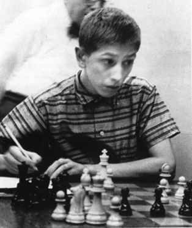
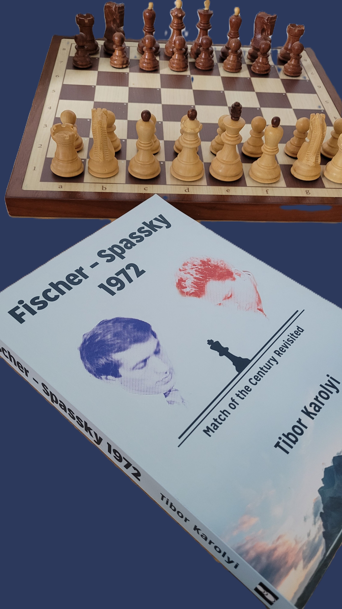

Intensity: Bobby Fischer - 1957

Whether historical chess games surpass contemporary ones is a subjective matter, hinging on individual preferences within the chess community. Examining the distinct characteristics of each era sheds light on the evolution of the game.

Historical chess games, exemplified by iconic clashes like the "Opera Game" (Paul Morphy vs. Duke Karl/Count Isouard, 1858), the "Immortal Game" (Adolf Anderssen vs. Lionel Adalbert Bagration Felix Kieseritzky, 1851), and the "Evergreen Game" (Adolf Anderssen vs. Jean Dufresne, 1852), are renowned for their creative brilliance. Delving into specific moves, sacrifices, and combinations from these games unveils a rich tapestry of daring strategies that have stood the test of time.

In contrast, contemporary chess games, featuring players like Magnus Carlsen, Fabiano Caruana, and Hikaru Nakamura, showcase a profound understanding of opening theory, meticulous calculation, and strategic planning. The influence of computer analysis is palpable, shaping a style characterized by precision and depth. However, this raises a pivotal question: do chess engines enhance or hinder creativity in modern play?

The advent of chess engines has undeniably transformed the landscape of the game. While engines offer unparalleled analytical capabilities, the risk of stifling human creativity looms large. The contemporary player's reliance on computer-assisted strategies prompts reflection on whether this reliance fosters originality or merely adherence to algorithms. However, players have become overly reliant on chess engines, using them as a crutch rather than developing their own skills and intuition. This has a big impact on the result with less exciting or dynamic games and stifle creativity and innovation.
A good example are my own openings. While I'm far away of a brilliant chess player, I truly believe with surviving the opening and surprising your oponent lead -even in games where engine can support- to dynamic games or extremly complex positions. That's the thrill and excitement that a chess engine would never replicate. And a chess engine would never play the opening the way I play it.

The evolution of chess theory is a dynamic narrative that spans centuries. From the rudimentary strategies of the past to the sophistication of contemporary openings, middlegame tactics, and endgame techniques, chess theory has experienced remarkable growth. Access to databases and computer-assisted analysis has accelerated this progression, providing players with unprecedented tools for honing their skills.

Ultimately, determining the "better" chess games is subjective, shaped by individual preferences for creativity, precision, or a harmonious blend of both. Striking a balance between the aesthetic beauty of historical games and the intellectual depth of contemporary ones is crucial. It prompts enthusiasts to consider their own inclinations within the diverse spectrum of chess appreciation.

Studying both historical and contemporary games becomes not just a recreational pursuit but an educational endeavor. Aspiring players benefit from exposure to diverse styles, gaining a comprehensive understanding of chess dynamics. Whether drawing inspiration from the bold brilliance of historical masters or the calculated precision of modern grandmasters, the chess aficionado embarks on a journey of continuous learning, contributing to the ever-evolving narrative of this timeless game.

# Once upon a time in Chess

Ever wondering about opening traps and such? You will like this one for sure.

Paris, 1759, the venue is the Cafe de la Regence, prototype of the chess café and the original home of the coffee house player. Here, Kermur Sire de Legal delivers a brilliant game which, despite its brevity, is also strategically remarkable, illustrating the complete triumph of pieceplay over pawn play. White actually only makes one pawn move.

[Event "Paris, Cafe de la Regence"]
[Site "?"]
[Date "1750.??.??"]
[Round "?"]
[White "Sire de Legal, Kermur"]
[Black "Saint Brie"]
[Result "*"]
[ECO "C41"]
[Annotator "Schroeer,Egbert"]
[PlyCount "13"]

1. e4 e5 2. Nf3 d6 3. Bc4 Bg4 {What a mistake! It is better to put the knights who are doing badly in the middle instead of the well-standing bishop (Lasker)} 4. Nc3 {The early development of both Knights (later propagated by Lasker) was a new strategy at that time; the pawn move c3 (with the double backing d4 and Qb3) was considered obligatory)} g6 {Black wants to control the strategic important square d4; totally fine if he would be able to play Bg7.} 5. Nxe5 Bxd1 6. Bxf7+ Ke7 7. Nd5# *

Lasker had games like this in mind when he formulated the rule in 1895: "Develop the knights before the bishop, especially the queens' bishop".

Funny enough, the top engine move 4. is h3, not Nc3!

# Another Nostalgic Journey through Chess History - "Fischer-Spassky 1972: Match of the Century Revisited" by Tibor Karolyi

Over the past 12 month I digged into Tibor Karolyi's masterpiece, "Fischer-Spassky 1972: Match of the Century Revisited," and I must say it was a truly captivating experience that not only rekindled fond memories but also provided invaluable insights for any senior chess enthusiast on their journey to improvement.

Karolyi's ability to present this iconic chess match with a fresh perspective is nothing short of stunning. The meticulous way in which he weaves together the intricate details of each game, coupled with his keen observations and analysis, makes the book an engaging and enlightening read. For someone who watched the original match on TV and followed the newspaper summaries, the book brought back a flood of youthful memories, adding an extra layer of sentiment to the entire experience.

One of the most significant aspects that make books like these indispensable for senior chess improvers is the rich learning opportunity they offer. Delving into historical matches, dissecting the strategies employed by chess legends like Fischer and Spassky, and understanding the context of the games can provide a unique perspective on chess evolution. Seniors can draw parallels between the past and the present, identifying timeless principles and strategic nuances that remain relevant in today's chess landscape.

Moreover, such books serve as a bridge between generations, connecting the chess enthusiasts of yesteryears with the contemporary chess world. They act as a repository of wisdom, preserving the essence of classical chess and offering a contrast to the fast-paced, digital era of online play. While online platforms undeniably provide a convenient space for practice, there's a profound depth and authenticity to studying classic matches that can't be replicated in virtual spaces.

In essence, "Fischer-Spassky 1972: Match of the Century Revisited" is not just a book; it's a journey back in time, a masterclass in chess strategy, and a reminder that the past holds invaluable lessons for those seeking improvement. For senior chess enthusiasts, it is a delightful voyage into nostalgia, a chance to relive the excitement of bygone matches, and an opportunity to extract timeless wisdom that transcends the boundaries of age and technology. Highly recommended for anyone passionate about the art and history of chess.

Let's go back in time and look at the game

> Donald Byrne - Robert J. Fischer - New York 1956

At the age of 13, Bobby Fischer played a game that made him famous in one fell swoop. It goes without saying that she received the beauty prize of the tournament. His opponent allowed himself inconspicuous negligence on the 11th move and, thanks to an astonishing maneuver by Black, was drawn into a tumult in which one surprise followed another. Ultimately, he feels compelled to conquer the black queen, but his king gets into a dilemma. It's unbelievable how the boy finds his way through the maze of variations and hits the most vital thing, move after move.
Fischer did not consider the game of the century worthy of inclusion in the anthology of his 60 memorable games. His opponent was his inexorable verdict, never had a real chance, and by accepting the queen's sacrifice on move 18, he violated the elementary duty of care that also applies to a minor.

I know this game was probably analized gazillion times, but it's worth to check again. I added some training questions for you.

<iframe style='border: 0;' width='900px' height='600px' src='https://share.chessbase.com/SharedGames/frame/?p=aH7zrDW0GH992RgtwOlbaiepDyZAWK6zN0d0p99YfAMnhMOw6rMTeu9gDP5qEvb5'></iframe>

Fischer played Byrne multiple times. According MegaDatabase this is the complete list with results.

| Game | Result | Location                              | Date       |
|------|--------|---------------------------------------|------------|
| 1    | 0-1    | New York Rosenwald-03, New York (8)   | 10/17/1956 |
| 2    | 1-0    | New York Blitz, New York              | 1957       |
| 3    | 0-1    | US Open-58, Cleveland (9)             | 08/13/1957 |
| 4    | 0-1    | USA-ch, New York (7)                   | 1958       |
| 5    | 1-0    | Western op-ch, Bay City (7)           | 07/07/1963 |
| 6    | 0-1    | USA-ch, New York (9)                   | 12/29/1963 |
| 7    | 0-1    | USA-ch 1966/67 Rosenwald Trophy, New York (5) | 12/17/1966 |
| 8    | 1-0    | Vinkovci, Vinkovci (11)                | 09/20/1968 |

# More history? A new Database in 2024

In my blog [Leveraging Chessbase with Mega Database and UltraCorr23 for Correspondence Chess Excellence](https://chess.myvortexcloud.com/reference-databases/) I introduced the UltraCorr Database 2023.

Timothy Harding PhD, Historian and FIDE Arbiter, just released the 2024 version. UltraCorr2024 has about 100,000 new games. The total size of the database is over 2,555,000 games. Except for Chess-960, it includes all recently played games from the servers of ICCF and FICGS (to end-2023) and LSS to June 2023, as well as games collected from other sources.

This edition was completely rebuilt from the original sources (instead of just adding games to the previous edition). Mr Harding spent most of his spare time during 2023 on this excellent work.

# More Training?

For me one of the most overseen training content from ChessBase are the 60 min courses.
What is it about? Compact video chess courses from top trainers: in just 60 minutes you will learn everything essential about a specific topic! 

So, why not take time out and enjoy an hour of great chess coaching! In the “60 Minutes” series trainers explain classic opening systems, or have a concrete improvements for your repertoire. The complete range of “60 Minutes” videos is available [online](https://videos.chessbase.com/en/fritztrainers60m) , free of charge with premium account!

**Don't miss the puzzle and game of the [week]( https://chess.myvortexcloud.com/Puzzle/)**

**Amici Sumus**

I'd love to hear your thoughts on today's post. Feel free to share your favorite chess strategy or ask any questions you may have.

> **Note:** [Subscribe to receive exclusive chess tips, updates, and strategies directly in your inbox](https://follow.it/senior-chess-improver?leanpub) 

> **Note:** [Follow me on Mastodon for chess insights and more.](https://mastodon.online/invite/mWSpfQP8)

