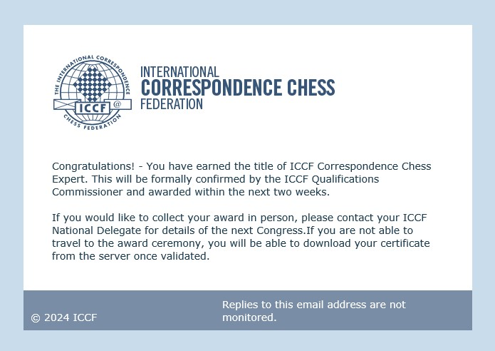

ICCF email February 6th 2024

# Introduction:

Chess is a game of endless possibilities, where each move opens up new avenues of strategy and potential success or failure. For many players, achieving a norm - a benchmark of excellence in competitive chess - seems like an impossible feat. Yet with time and persistence, the thrill of the game and the pursuit of mastery can still be attained.

In February 2024, at age 65, I accomplished the unexpected - earning my second norm and the title of Correspondence Chess Expert (CCE) as a senior chess improver. It was a proud milestone, reflecting my dedication, perseverance, and passion for the game.

In this post, I will recount the two tournaments pivotal to achieving this norm, including critical moves and decisions. Each game exemplified the enduring spirit of chess and the joy of continued improvement. I invite you to join me in celebrating this momentous occasion in my chess journey.

## ICCF Titles and Norm Requirements

The ICCF awards various titles in recognition of players' achievements². The qualification for these titles is dependent upon achieving norms, which are linked to ratings². Here are some of the titles and the minimum rating performances required to achieve a norm for each²:

- Grandmaster - 2600
- Senior International Master - 2525
- International Master - 2450
- Ladies Grandmaster - 2300
- International Ladies Master - 2150

>Note: Norms only count in 8+ game ICCF International Title events.

## About the CCE Title

The Correspondence Chess Expert (CCE) title has been awarded by the ICCF since 2016. Two norms are required to earn the CCE title.

Female CCE title holders can convert their title to International Ladies Master (LIM) or Ladies Grandmaster (LGM) by contacting the ICCF.

ICCF rules have changed over time - for example, Master Norm and GM Norm events were replaced by the CCE title requirements. Refer to the latest ICCF Rules for details.

# My Critical Games

I needed two norms to gain the CCE title. My first norm came from the 2021 ICCF Champions League event. The second was in a dedicated CCE Norm tournament.

### Champions League 2021

Two games were critical to my success in the Champions League tournament 2021. I played first time in the league, which is a team tournament. Four players I never met befor and without unknown strength and skill built the the team 'The Underrateds'. I played board 2, lost 2 games of 12 and secured 10 draws.

The first game is The Underrateds - The 4 Knights - (Schroeer, Egbert vs. Rodríguez Pérez, René)

Two games were pivotal in achieving my first norm in the Champions League team tournament. As "The Underrateds" board two, I scored 10 draws and 2 losses out of 12 games.

The first critical game was against CCE René Rodríguez Pérez. I secured a draw despite having the chance for a win probably.

<iframe style='border: 0;' width='760px' height='480px' src='https://share.chessbase.com/SharedGames/frame/?p=JbJTTNMxNcweG9PrY3WqHbZir/D1PizSxLgyNrq+LOW203/D/mGft70UtKctNtE8'></iframe>

The second game, I missed a win against due to three inaccuracies, which cost me the win I expected. But a draw sufficed for the norm. My performance helped the team, though we did not advance in rankings.

<iframe style='border: 0;' width='760px' height='480px' src='https://share.chessbase.com/SharedGames/frame/?p=sGgcV78qsf8SpszYMbL1EAfH5gkK4m834T77S0OHKtU4d6/OBPYqmhymIR+EF+Bi'></iframe>

### If you are interested in the full tournament, you can find the replays [here](http://cloudserver.chessbase.com/Mzg0NDk5MDg=/replay.html)

### CCE Norm Tournament

My second norm came in the WS/CCE/A/30 event organized by the ICCF. This 15 player international tournament required a 2125-2199 rating plus other qualifications. A key win with the black pieces in this tournament helped secure my second norm and the CCE title.

<iframe style='border: 0;' width='760px' height='480px' src='https://share.chessbase.com/SharedGames/frame/?p=bt1jUiPMc09l3Lea+wzC+PuC0rGwSz2Dlek5u1f19kDpL6xqQq86He6zAL5eMnxe'></iframe>

### If you are interested in the full tournament, you can find the replays [here](http://cloudserver.chessbase.com/Mzg0NTEwMTE=/replay.html)

# Conclusion

Earning the CCE title as a senior player was an unexpected delight, proving dedication and passion for chess can pay off at any age. I'm honored to have achieved this milestone and look forward to the continued adventure of improving my game.

I welcome your thoughts and encourage other senior players to keep pursuing chess goals!

**Amici Sumus**

**Don't miss the puzzle and game of the [week]( https://chess.myvortexcloud.com/Puzzle/)**

> **Note:** [Subscribe to receive exclusive chess tips, updates, and strategies directly in your inbox](https://follow.it/senior-chess-improver?leanpub) 

> **Note:** [Follow me on Mastodon for chess insights and more.](https://mastodon.online/invite/mWSpfQP8)