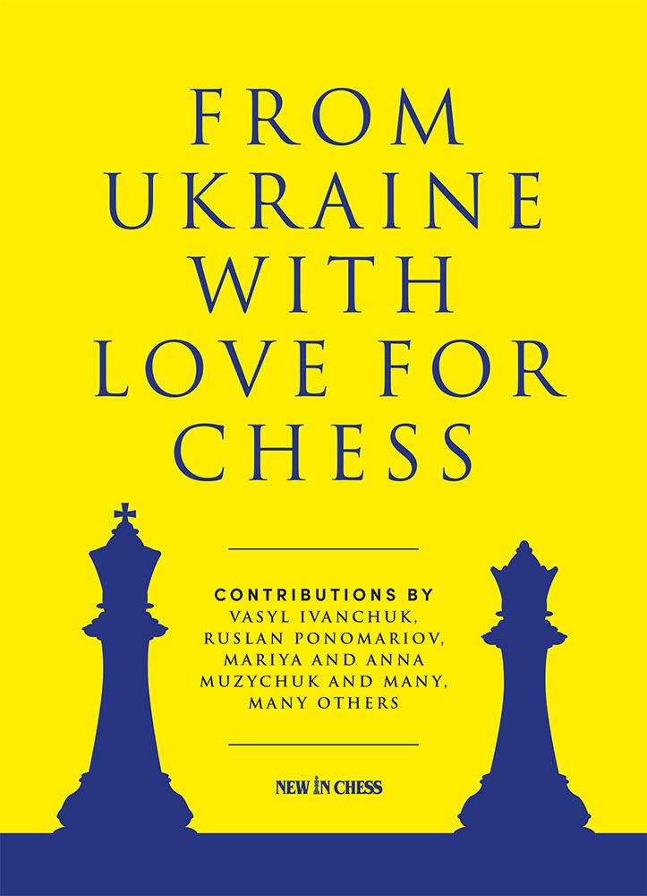
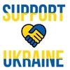

Photo by <a href="https://www.newinchess.com/from-ukraine-with-love-for-chess">New in Chess</a>

Against the backdrop of the ongoing crisis involving Russia's invasion of Ukraine, allowing Russian players to compete raises ethical questions about the principles of peace, freedom, and human rights that should guide our sport. While chess is a game of strategy and intellect, it is also a reflection of our values and beliefs.

Today, on February 24th, as a chess community, we need to pause, reflect, and take action.

Every year since the invasion and the brutal war on Ukraine by Russia, Peter Doggers from chess.com writes an article to remind us of the impact of the war on Ukrainian chess players. Very well written with empathy and profound information.

- [Ukrainian Chess Players In Times Of War](https://www.chess.com/news/view/ukrainian-chess-players-in-times-of-war)

- [A Year Of War For Ukrainian Chess Players](https://www.chess.com/news/view/one-year-war-ukraine-chess-players)

There is also a great supporting/awerness articel in "New in Chess"
about [Natalia Zhukova](
https://www.facebook.com/photo/?fbid=10218443301228439&set=ecnf.100000354421769) Cover posted on her Facebook page.

> All we Ukrainians want is to be left in peace

What a powerful statement! Zhukova runs a charity for Ukrainian chess players that are effected by the war. It's a touching and  powerfull interview, done in 2022 but but is a timeless interview valid now and in hundred years to come!

Another great read and learning is the supporting book which I bought a year ago:

**From Ukraine with Love for Chess**

With contributions by the great Vasyl Ivanchuk, Ruslan Ponomariov, Mariya and Anna Muzychuk and many, many others

Photo by <a href="https://www.newinchess.com/from-ukraine-with-love-for-chess">New in Chess</a>

A book with great learnings where FIDE World Champion Ruslan Ponomariov coordinated this wonderful collection of chess games from Ukrainian players. All games were nominated and annotated by the players themselves. The proceeds of this book will support Ukrainian charities.

## Empathy and Ethics?

On February 20th, when the pairings for the upcoming **Champions League 10** were finalized and all teams and players received their invitations, I started preparing myself for my opponents, collecting games, and studying their openings and defensive strategies. The Champions League 10 (2024-2026) is a correspondence chess team tournament played in biennial cycles.

However, I was shocked to discover the participation of five Russian chess player teams named **Volga-Moscow**-1 to 5 - each consisting of 4 players - in the upcoming Champions League tournament.

I wrote an open letter to Eric Ruch, ICCF President, to express my profound concern regarding their participation in the tournament scheduled to commence on February 25th, coinciding with the tragic anniversary of Russia's invasion of Ukraine. The ongoing crisis in Ukraine has led to unimaginable suffering, including a humanitarian catastrophe with significant loss of life and widespread displacement.

As chess enthusiasts, we have a responsibility to engage with our national delegates and ICCF officials to express our concerns and advocate for ethical decision-making.

Creating awareness about these issues is the first step towards fostering meaningful dialogue and promoting positive change within the chess community. Together, we can uphold the integrity of our sport and ensure that our actions reflect the values we hold dear.

I encourage fellow chess enthusiasts to join me in raising awareness about this important issue and engaging in constructive dialogue with relevant stakeholders. By working together, we can make a difference and uphold the principles of peace, freedom, and human rights within the world of chess.

> **_NOTE:_**   Message from Jason Bokar, ICCF-US Director  [on March 2022](http://iccfus.com/220308News.htm) to the chess community: .."we also shouldn’t remain silent"

## Open Letter

> Dear ICCF Board Members,
>
>I am writing to express my profound concern regarding the participation of Russian chess players, particularly Team(s) Volga-Moscow-1 to 5, in the upcoming Champions League tournament scheduled to commence on February 25th, coinciding with the tragic anniversary of Russia's invasion of Ukraine. The ongoing crisis in Ukraine has led to unimaginable suffering, including a humanitarian catastrophe with significant loss of life and widespread displacement.
>
>What further exacerbates my concern is Chessify's sponsorship of the event. While I appreciate Chessify's support for the Champion’s League with an award package worth $5000 in Chessify packages and coins, I am deeply troubled by the potential implications of this sponsorship. It is disheartening to contemplate an award package going to Russia and a team named Volga-Moscow associated with the event, especially when the participation of Russian players contradicts the principles of peace, freedom, and human rights that the ICCF aims to uphold.
>
>While I commend the ICCF for its efforts, such as organizing the Peace Open tournament to express solidarity with Ukraine, allowing Russian players to compete in official tournaments undermines the very principles of peace, freedom, and human rights that the ICCF stands for.
>
>The invasion of Ukraine represents a blatant violation of international law and a tragic humanitarian crisis. Furthermore, it is a genocide against the people of Ukraine and threatens the very values that the chess community should stand for. Regardless of the neutral flags under which they compete, the participation of players with ties to Russia implicitly condones the actions of the Russian government and undermines efforts to promote peace and justice.
>
>As a fervent believer in a world where peace, freedom, and human rights are non-negotiable values, I urge the ICCF to take immediate action to suspend Russian players from official tournaments until the conflict is resolved and justice is restored. This step is essential not only to uphold the integrity of the sport but also to demonstrate solidarity with the victims of aggression and injustice.
>
>I encourage the ICCF to reconsider its stance and demonstrate leadership by aligning its actions with the principles it claims to uphold. While I can only speak for myself, I truly believe the chess community looks to the ICCF to maintain the highest standards of ethics and morality, and I hope you will act quickly in this critical moment. You can make a difference!
>
>This topic touches me deeply, and I am a constant supporter. Even if my support may seem small, I firmly believe that every little bit matters in making a difference and making the world a better place.
>
>Thank you very much for dealing with this matter, which is important to me.
>
>Sincerely,
>
>Amici Sumus  - We Are Friends,
>
>*Egbert Schroeer, CCE*

---

**Support Revive Soldiers of Ukraine**

If you found this post insightful and would like to support the **Revived Soldiers of Ukraine** organization, please consider donating through my **Buy Me a Coffee** widget on this page (or directly) and all blogs with content related to the topic or when I annotate and review games versus Ukrainian chess players. Your contribution will help provide assistance to those affected by the conflict in Ukraine.

Thank you for your generosity and support.

Amici Sumus

>Supporting Information and Links

- Giving is personal and there are many ways to give. I support [Revived Soldiers of Ukraine,  a well-established 501(c)(3) U.S. charity](https://www.rsukraine.org/). You can buy me a coffee with the link in this post and it will be donated.
- [From Ukraine with Love](https://www.newinchess.com/from-ukraine-with-love-for-chess), New in Chess, 2022
- My blog post to create awareness [Another Year to Come](https://chess.myvortexcloud.com/Another-Chess-Year-to-Come/)
- My blog post to create awareness [Amici Sumus: Finding Unity and Strength in Chess - My Journey at the Peace Open Tournament](https://chess.myvortexcloud.com/Peace-Open-Amici-sumus/)

- You like puzzles or wooden tech models?

    ‘U’ in [UGEARS](https://ugears.us) stands for 'Ukrainian
    
    [Unidragon]( https://unidragon.com) puzzles are proudly made in Ukraine. The company is based in Kyiv

And there is more... you will find your way how to support!

