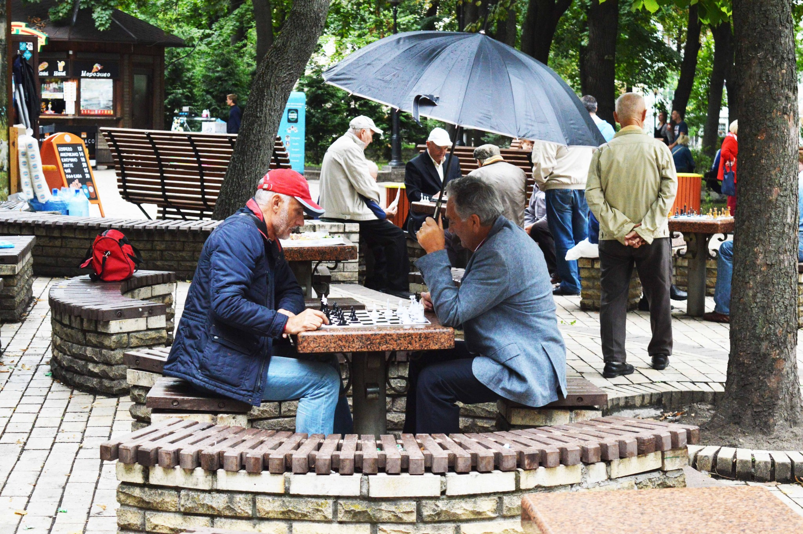

*Central Kyiv park gathers chess players all year long (2017)*

While the new year approached with violence in some areas of the world, I thought it was a good idea to reflect on this horrific war in Ukraine with an example to share because the war in Ukraine also changed the lives of chess players. Like many Russian grandmasters, some now live abroad to pursue their “trade.” The general rule is that all men between 18 and 60 cannot leave the country, but the Ukrainian Sports Ministry allowed them to play. Thanks to this exception, many top Ukrainian players have been able to participate in tournaments abroad.

In this context, reflecting on the ongoing war in Ukraine and its profound impact on chess players is crucial. Despite the hardships, the stories of resilience within the chess community shine as beacons of hope.

## Igor Kovalenko - in the trenches

Igor Kovalenko (34) is one of the strongest grandmasters in his country. The regular player of the Viernheim chess club in Germany has been serving in the army since April 2022, for which the aspiring priest of the Jewish Messianic community in Kyiv has volunteered and is fighting the enemy "unmanned aerial vehicles" in the Donetsk region. He and his comrades-in-arms are deeply entrenched in the positions at the front. "Like moles..." he reported to the chess journalist Conrad Schormann. The chess pro and clergyman has learned to use an axe, pickaxe, and shovel and is preparing to spend a few years in the woods - including this Christmas. Above all, his view of life has changed: "The concern about being a grandmaster, which moved me before the war, now seems ridiculous to me." Despite all this, with usually only three hours of sleep, the game of chess is still important to him "as a bridge to a normal life." Even if only online.

And this is his online blitz game on December 12, 2023

[Event "Titled Tuesday intern op 12th Dec Early"]
[Site "Chess.com INT"]
[Date "2023.12.12"]
[Round "2"]
[White "Kovalenko, Igor"]
[Black "Mendez Fortes, Eduardo Jesus"]
[Result "1-0"]
[ECO "A13"]
[WhiteElo "2674"]
[BlackElo "2231"]
[PlyCount "81"]
[Beauty "7630412059145"]
[EventDate "2023.12.12"]
[EventType "swiss (blitz)"]
[EventRounds "11"]
[EventCountry "USA"]
[SourceTitle "Mega2023 Update 59"]
[Source "Chessbase"]
[SourceDate "2023.12.21"]
[SourceVersion "1"]
[SourceVersionDate "2023.12.21"]
[SourceQuality "1"]

1. c4 e6 2. g3 Nf6 3. Bg2 d5 4. Nf3 dxc4 5. Qa4+ Nbd7 6. Qxc4 a6 7. Qc2 c5 8. a4 {A13: English Opening: 1...e6.} Bd6 9. a5 Qc7 {[#]} 10. O-O $146 {White is slightly better.} ({Predecessor:} 10. d3 b5 11. axb6 Nxb6 12. Nfd2 Bb7 13. Bxb7 Qxb7 14. O-O O-O 15. Na3 Nbd5 16. Nac4 {1-0 Sorensen,H (2192)-Sevastianov,A (2112) SWE-chT 1819 Superettan Sweden 2018 (3)}) 10... O-O 11. d3 e5 12. Nbd2 Nd5 13. Nc4 Nb4 14. Qb3 Nc6 15. e3 {White is much more active. The black rooks are passive.} Re8 16. Bd2 ({Don't play} 16. Nxd6 Qxd6 17. Ng5 Rf8 $16) 16... Rb8 17. Ng5 Nf6 $2 {5.47/24 [#]} (17... Rf8 $16 {1.56/28 is a better chance.}) 18. Qb6 $2 {0.17/29} (18. Nxd6 $18 {5.47/24} Qxd6 19. Qxf7+ Kh8 20. Qxe8+ {Clearance} Nxe8 21. Nf7+ Kg8 22. Nxd6 Nxd6 23. Rfc1) 18... Qxb6 $2 {1.99/26} (18... Qe7 $11 {0.17/29}) 19. axb6 $18 Bf5 $2 {5.59/29} (19... Be7 {1.86/28 is tougher.} 20. Bc3 Nd7) 20. Bxc6 {White is clearly winning.} bxc6 21. e4 Bc8 22. Nxd6 {Excellent horsemanship.} Rd8 23. Nxc8 Rdxc8 24. Rxa6 Rd8 25. Bc3 Nd7 26. Nf3 f6 27. b7 Rxb7 28. Rxc6 Kf7 29. Ra1 Nf8 30. Rxc5 Rxd3 31. Kg2 Ne6 32. Rc8 Rdd7 33. h4 h6 34. h5 Rb5 35. Raa8 Nc5 36. Rf8+ Ke6 37. Rfe8+ Kf7 {[#]} 38. Bxe5 $1 {Rf8+ is the strong threat.} Nxe4 (38... Ne6 39. Bc3) 39. Rab8 Rbd5 40. Bf4 Rc5 41. Rxe4 {Weighted Error Value: White=0.33/Black=0.68.  Loses game:        ---         Black=2      Missed win:        White=1         ---        Mistake:         ---         Black=1      Inaccurate:        White=2         Black=7      OK:            White=8         Black=5} 1-0

And on the same day, an excellent game with Black.

[Event "Titled Tuesday intern op 12th Dec Early"]
[Site "Chess.com INT"]
[Date "2023.12.12"]
[Round "3"]
[White "Chinguun, Sumiya"]
[Black "Kovalenko, Igor"]
[Result "0-1"]
[ECO "B01"]
[WhiteElo "2319"]
[BlackElo "2674"]
[PlyCount "40"]
[Beauty "8249046466571"]
[EventDate "2023.12.12"]
[EventType "swiss (blitz)"]
[EventRounds "11"]
[EventCountry "USA"]
[SourceTitle "Mega2023 Update 59"]
[Source "Chessbase"]
[SourceDate "2023.12.21"]
[SourceVersion "1"]
[SourceVersionDate "2023.12.21"]
[SourceQuality "1"]

1. e4 d5 2. exd5 Qxd5 3. Nf3 Bg4 4. d4 Nc6 5. c3 O-O-O 6. Be2 Nf6 {B01: Scandinavian Defence.} 7. h3 Bh5 8. O-O e6 {The position is equal.} 9. Bf4 Bd6 10. Bxd6 Qxd6 11. Nbd2 {[#]} Qe7 $146 ({Predecessor:} 11... Nd5 12. Nc4 Qe7 13. Nfe5 Nxe5 14. Nxe5 Bxe2 15. Qxe2 Rhe8 16. Qf3 f6 17. Nd3 Qd6 {0-1 Krutina,I (2128)-Janda,P (2088) CZE-chT2J 0203 Czech Republic 2002 (7)}) 12. b4 {Hoping for b5.} Nd5 13. Qb3 Nf4 14. Bd1 e5 $2 {1.94/29} (14... g5 $11 {0.15/31 and Black is okay.}) 15. Nxe5 {-4.26/19 Now White is beyond hope.} (15. b5 $18 {1.94/29 and all is fine.} Na5 16. Qa4) (15. Re1 $16 {1.23/19 and life is bright.}) 15... Nxe5 $19 {Pin} 16. Bxh5 {[#]} Qg5 {Deflection, Double Attack} ({Stronger than} 16... Nxh5 $2 {0.54/20 16...Qg5 -5.71} 17. Rfe1 f6 18. Rad1 $11) ({Inferior is} 16... Nxh5 17. Rae1 f6 18. f4 Nxf4 (18... Ng3 19. Rf2 $16) 19. Rxf4 $14) 17. g4 Nxh3+ {Discovered Attack. A dynamic duo of knights.} 18. Kh2 Nf4 {( -> ...Qh4+)} 19. dxe5 Qh4+ 20. Kg1 Qh3 {Weighted Error Value: White=1.28/Black=0.29 (precise) .  Loses game:       White=1         ---        Inaccurate:      White=4         Black=5      OK:            White=5         Black=3      Best:          ---         Black=1} 0-1

## Artem Sachuk - A Chess Figure Lost, But Not Forgotten

Artem Sachuk, a renowned chess player and vice president of Ukraine's Chess Federation, has been killed in action while defending his country against Russia's unprovoked invasion, the federation announced on November 26.

"Ukrainian volunteer soldier Artem Sachuk died in the war of liberation against the Russian occupiers - a famous chess figure, candidate for master of sports, vice president of the Chess Federation of Ukraine, organizer of many all-Ukrainian and international competitions. Eternal memory," the Chess Federation of Ukraine announced on its Facebook page.

According to Suspilne, the information about the death of Artem Sachuk from Zhytomyr was confirmed in the Zhytomyr City United TCC and SP. They also said that they are currently investigating the circumstances of his death.

In September, Artem Sachuk reported being in the army for 1.5 years.

In October, Minister of Youth and Sports Vadym Gutzait announced that 361 Ukrainian athletes and coaches died in the Russian-Ukrainian war.

Here is an interesting game from Ukrainian Summer Youth Games 2002, where both White and Black missed a win:

[Event "UKR Summer Youth Games"]
[Site "Evpatoria"]
[Date "2002.05.21"]
[Round "9"]
[White "Tkach, Vladimir"]
[Black "Sachuk, Artem"]
[Result "0-1"]
[ECO "C70"]
[PlyCount "76"]
[EventDate "2002.05.13"]
[EventType "swiss"]
[EventRounds "9"]
[EventCountry "UKR"]
[SourceTitle "EXT 2003"]
[Source "ChessBase"]
[SourceDate "2002.11.25"]
[SourceVersion "1"]
[SourceVersionDate "2002.11.25"]
[SourceQuality "1"]

1. e4 e5 2. Nf3 Nc6 3. Bb5 a6 4. Ba4 b5 5. Bb3 Na5 6. O-O Nxb3 7. axb3 d6 8. d4 f6 {[#]} 9. b4 $146 {C70: Ruy Lopez: 3...a6 4 Ba4, Norwegian and Delayed Schliemann.} ({Predecessor:} 9. Nc3 Bb7 10. Nh4 Qd7 11. Nd5 Qf7 12. c4 c6 13. Ne3 Ne7 14. d5 cxd5 15. cxd5 g6 16. Bd2 f5 17. Rc1 Rc8 18. Rxc8+ Bxc8 19. exf5 gxf5 {1-0 Anand,V (2710)-Timman,J (2635) Linares 11th 1993 (1)}) 9... Ne7 {Repels c4} 10. Nc3 {Hoping for Nxb5.} Bb7 11. d5 {White is slightly better.} c6 12. Ne1 cxd5 13. exd5 g6 (13... Qc8 {is interesting.} 14. f4 Qc4 15. Qh5+ g6) 14. Be3 Bg7 15. Qd2 Nf5 16. g4 Nxe3 17. fxe3 O-O 18. e4 Qd7 19. Qe2 Rac8 20. Ng2 Rc4 21. Ne3 Rxb4 22. b3 Bc8 23. Qf3 Bh6 24. h3 Qa7 25. Rae1 f5 26. gxf5 gxf5 {White must now prevent ...Qc5.} 27. Kh1 Bxe3 28. Rxe3 Qe7 (28... f4 29. Re2 Rd4 30. Rg1+ Kh8 31. Nb1 $11) 29. Rg1+ Kh8 30. Qh5 f4 {0.00/47 Against Reg3} ({Better is} 30... fxe4 $1 $19 {-2.62/29 And now ...Rd4 would win.} 31. Qh6 Bf5) 31. Re2 $1 $11 {aiming for Reg2.} Rd4 $2 {3.79/31 [#]} (31... Qd7 $11 {0.00/47 and Black has nothing to worry.}) 32. Reg2 $1 $18 {Threatening mate with Qh6.} f3 {[#]} 33. Rf2 {-4.38/24} (33. Qxf3 $1 $18 {3.89/28 was the only winning move.} Rd2 (33... b4 $2 34. Qg3 $18) 34. Rg5) 33... b4 $19 {Black is clearly winning.} 34. Nd1 Rxe4 35. Rxf3 Rxf3 36. Qxf3 Rf4 (36... Rh4 $2 37. Rg3 $19) 37. Qg2 Qf8 {Dodges Qg8+. ...Rf3 is the strong threat. Active counter play!} 38. Kh2 Rf3 {Quite a comeback for Black.   Weighted Error Value: White=0.61/Black=0.43.  Loses game:        ---         Black=1      Missed win:        White=1         Black=1      Inaccurate:        White=9         Black=3      OK:            White=5         Black=14     Best:          ---         Black=3      Strong:        White=2         ---} 0-1

## Unity and Resilience in the Chess Community

The chess community is a testament to resilience and unity in the face of global challenges. Despite the adversities, initiatives, and events within the chess world have exemplified the strength and support that binds this community together.

The shared passion for chess has transcended borders and differences, fostering a sense of camaraderie that goes beyond the chessboard. Players, organizers, and enthusiasts have come together to showcase the unwavering spirit of the chess community.

Let's celebrate the stories of individuals like Igor Kovalenko, who, amidst the chaos of war, finds solace and normalcy in the game of chess. His dedication reflects chess's profound impact, serving as a bridge to a semblance of a regular life even in the most challenging times.

As we remember the loss of Artem Sachuk, a chess figure who gave his life defending his country, let us honor his memory by recognizing the strength that chess instills in its practitioners.

The positive message is clear: Chess not only endures but thrives, providing a space for unity, support, and resilience. Together, the chess community continues to inspire, reminding us that even in the darkest times, the game's power can shine a light of hope and solidarity.

**Amici Sumus**

I'd love to hear your thoughts on today's post. Feel free to share your favorite chess strategy or ask any questions.

> **Note:** Check out week 1 and 2 puzzle and games of the [week](https://egbert-azure.github.io/Puzzle/)

> **Note:** [Subscribe to receive exclusive chess tips, updates, and strategies directly in your inbox](https://follow.it/senior-chess-improver?leanpub) 

> **Note:** [Follow me on Mastodon for more chess insights.](https://mastodon.online/invite/mWSpfQP8)