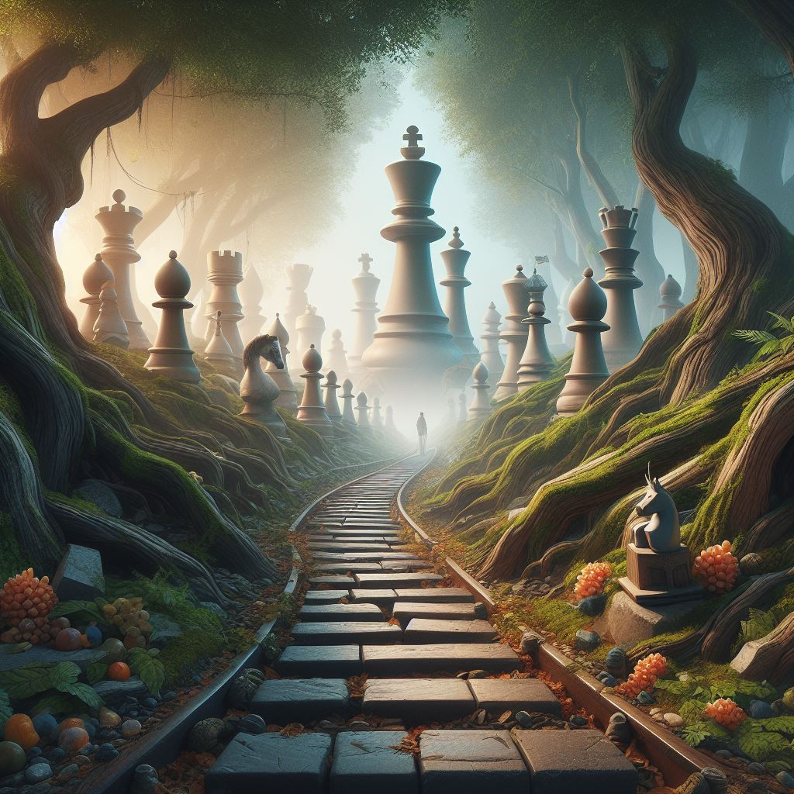
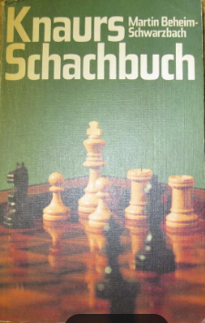

I learned chess from my dad when I was about six years old. It was just for fun and on a cheap board with cheap chess pieces, part of a game collection with checkers and others. My dad passed away way too early in 1971 after his third heart attack and would have turned 100 this year in November. I'm curious what he would think about today's chess world; that thought makes me smile.

I have never played in a chess club in Germany, but I played against some members of chess clubs. Also, I never played real competitve chess. However, the Fischer boom, Helmut Pfleger and  Vlastimil Hort, and their Schach der Großmeister German television show influenced me. There was literally no TV broadcast I missed. At a time when there was no streaming and no video recording, that means a lot.

Bobby Fischer was different; it was East versus West in the middle of the Cold War. The chess match between Bobby Fischer and the Russian defending champion Boris Spassky still fascinates me today; it is indeed a "Match of the Century" that continues to have an impact to this day.

During my night shifts, when I worked as a chemical technician to finance studying chemistry at the University of Essen and making a living, I played chess with my colleagues during breaks, which was kind of competitive because, like chess hustlers today, we played for some money.

Within the family, my godfather was able to play chess. He thought he was good; I never said he was not. Every Christmas, we played some games or during some visits to my grandma's house, where he lived with his family.

Talking about family. At that time in the mid sixties and following, there have been two different newspaper in my hometown Dorsten. Both had for every weekend a chess puzzle and a chess game, sometimes with annotation, but at least a short introduction to set the context. While we had one newspaper my aunt had the other edition. She collected each week those games and I picked them up. I re-played every game and solved every chess puzzle every week.

My first chess book I bouhgt was 1972, Martin Beheim Schwarzbach 'Knaurs Schachbuch - Ein Jahrhunder Schach in Meisterpartien', in English 'Knaur's Chess Book - A Century of Chess in Master Games'.
I literally played EVERY game multiple times to recoginze patterns and the ideas behind moves in the middle and endgame.
Mr. Beheim-Schwarzbach unique very entertaining writing style really caught me.

The same style has Dr. Helmut Pfleger and since today, he is writing a weekly chess column, which I highly recommend. Here an example (translated into english):

> Does anyone else have any doubts that playing chess keeps you young? At the German Senior Team Championship OVER 65 in Böblingen, the North Rhine-Westphalia II team won the bronze medal with the veteran warriors Erich Krüger (91) and Willy Rosen (90). While Krüger had recently become German Nestor Champion (from 75), this time his friend and club colleague in Essen-Katernberg, Willy Rosen, was supposed to play a special role. For the first time he played together with his son Bernd, who had just turned 65, in the senior team - with "Papa" Willy being almost as good with 5 points from 7 games as Filius Bernd with 5 from 6 at the top board. What both found to be a “pretty unique thing,” as Hartmut Metz writes in Schach-Magazin 64. Why “quite”? Are the two of them already thinking about the next championships up to the hundredth?! There seems to be little to stand in the way of this, especially since dad now always wears a helmet after a bicycle fall in 2020. The final all-clear was given when he scored 2.5 points from three games against Erich Krüger at their weekly meeting: “Everything had to be okay!” Finally, the decisive battle of the last round against the former bridge world champion Georg Nippgen from Baden (who still became champions). What cunning triangular maneuver did Willy Rosen use to gain a decisive advantage as Black's turn?

[Click here](https://www.zeit.de/zeit-magazin/2023/49/schach) for the original full german version from Zeit Magazine.

My brother-in-law, Sleh Badoui, was a fantastic chess player, and we played very often. Sleh studied art and graphics at Sorbonne in Paris and lived in the Netherlands but was born in Tunis. He passed away from cancer.

I embarked on a chess comeback in 2020 after a 25-year hiatus from the game. Despite the long break, my passion for chess was rekindled, and I quickly immersed myself in the world of chess, determined to make my mark once again.

    

Since my return, I've achieved significant milestones in correspondence chess. My imminent second norm in correspondence chess with the ICCF underscores my ability to strategize and execute plans meticulously over extended periods.

Breaking through the 2000 Elo rating in USCF within a short time frame is a testament to my innate chess skills and relentless pursuit of improvement. My participation in the Electronic Knights 2021 semi-finals showcases my adaptability to the modern chess landscape and my competitive spirit.

Even as a chess veteran who returned to the game after a quarter-century break, I fearlessly ventured into the ICCF Veterans World Cup semi-finals, demonstrating that age is no barrier to achieving success in this intellectually stimulating pursuit.

I also signed up for the ICCF Veterans World Cup 14 and just finished a game against the Ukrainian Internation Master Valeriy Khanas (2384)

Valery is a well-known and very experienced player. Given the situation in Ukraine, how he plays and who plays during these uncertain times is even more impressive.
So, I thought, for this blog, I will share the game.

<iframe style='border: 0;' width='900px' height='600px' src='https://share.chessbase.com/SharedGames/frame/?p=gK+iCe5Bu9Z5ZHluUzCVcI+xSSUn6CsfPE9+lT/Ao8w+ykUA47gcTcTM/0fKlKMB'></iframe>

Details about Valeriy:
Valeriy Khanas is an International Correspondence Chess Master (IM) with a rating of 23531. He has completed 961 games, winning 157 of them, and has played 36681 moves in 90 tournaments1. He achieved the title of IM in 2021, Correspondence Chess Master (CCM) in 2019, and Correspondence Chess Expert (CCE) in 2018. He also participated in the ICCF Veterans World Cup 9 Final in 2020 and the Esko Nuutilainen Memorial Team Tournament Final Board 1 Ukraine in 20191.

You can find some of his games on the International Correspondence Chess Federation's website.

His Chessbase player entry can be found [here](https://players.chessbase.com/en/player/Khanas_Valeriy/503090).

And his impressive ICCF profile is [here](https://www.iccf.com/player?id=941140).

My journey is a testament to the enduring allure of chess and the limitless potential for self-improvement at any age. I remain deeply committed to chess, continuously honing my skills and embracing this timeless game's challenges.

And October 2023 marked the next milestone and achievement: I was ranked nr. 90 in the top 100 US correspondence chess players.

Amici Sumus

I'd love to hear your thoughts on today's post. Feel free to share your favorite chess strategy or ask any questions you may have.

> **Note:** [Subscribe to receive exclusive chess tips, updates, and strategies directly in your inbox](https://follow.it/senior-chess-improver?leanpub) 

> **Note:** [Follow me on Mastodon for more chess insights.](https://mastodon.online/invite/mWSpfQP8)
