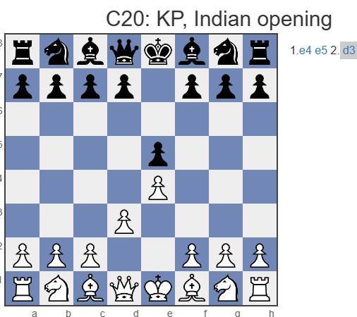

You want to compile a database with selected games/positions for tactics training with just a few clicks?
Within a game list, mark the games that should serve as the basis for the training database to be created.
You do not have to limit yourself to selected game entries, alternatively mark all games in the database.

Right-click on the marked game entries - Context menu - Harvest training material

You can save the results in a new database in the next step. The standard engine performs a quick check and saves matching positions with training questions within the database. When you load an entry from the database list, the game position incl. training question is displayed. Therefore activate under Training - Activate training.