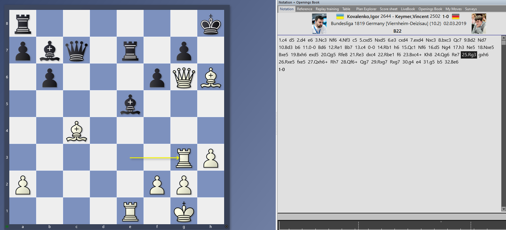

## Puzzle of the Week

## Game of the Week

[Event "Bundesliga 1819"]
[Site "Germany"]
[Date "2019.03.02"]
[Round "10.2"]
[White "Kovalenko, Igor"]
[Black "Keymer, Vincent"]
[Result "1-0"]
[ECO "B22"]
[WhiteElo "2644"]
[BlackElo "2502"]
[PlyCount "63"]
[EventDate "2018.11.10"]
[EventType "team-tourn"]
[EventRounds "15"]
[EventCountry "GER"]
[SourceTitle "CBM 189 Extra"]
[Source "ChessBase"]
[SourceDate "2019.06.03"]
[SourceVersion "1"]
[SourceVersionDate "2019.06.03"]
[SourceQuality "1"]
[WhiteTeam "Viernheim"]
[BlackTeam "Deizisau"]
[WhiteTeamCountry "GER"]
[BlackTeamCountry "GER"]

1. c4 d5 2. d4 e6 3. Nc3 Nf6 4. Nf3 c5 5. cxd5 Nxd5 6. e3 cxd4 7. exd4 Nxc3 8. bxc3 Qc7 9. Bd2 Nd7 10. Bd3 b6 11. O-O Bd6 12. Re1 Bb7 13. c4 O-O 14. Rb1 h6 15. Qc1 Nf6 16. d5 Ng4 17. h3 Ne5 18. Nxe5 Bxe5 19. Bxh6 exd5 20. Qg5 Rfe8 21. Re3 dxc4 22. Rbe1 f6 23. Bxc4+ Kh8 24. Qg6 Re7 25. Rg3 gxh6 26. Rxe5 fxe5 27. Qxh6+ Rh7 28. Qf6+ Qg7 29. Rxg7 Rxg7 30. g4 e4 31. g5 b5 32. Be6 1-0

> **Note:** [Subscribe to receive updates](https://follow.it/senior-chess-improver?leanpub)
